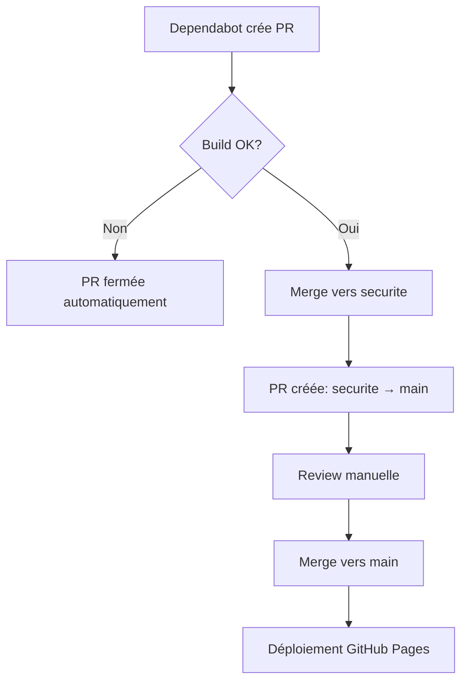

# Configuration Guide - DependabotSecureFlow

Guide complet pour paramétrer et personnaliser DependabotSecureFlow.

---

## Architecture du Projet

```
dependabot-secure-flow/
├── .github/
│   ├── dependabot.yml              # Config Dependabot (horaires, écosystèmes)
│   ├── workflows/
│   │   ├── dependabot-secure-flow.yaml  # Workflow principal
│   │   └── release-notification.yaml    # Notifications de release
│   └── FUNDING.yml                 # Sponsors
├── docs/
│   └── CONFIGURATION.md            # Ce fichier
├── index.html                      # Site GitHub Pages
├── action.yml                      # Action composite (Marketplace)
├── README.md                       # Documentation principale
├── CHANGELOG.md                    # Historique des changements
└── package.json                    # Dépendances npm
```

---

## Flux de Travail



### Branches

| Branche | Rôle | Déploiement |
|---------|------|-------------|
| `main` | Production | GitHub Pages |
| `securite` | Staging/Validation | - |

---

## Fichiers de Configuration

### 1. Dependabot (`.github/dependabot.yml`)

Contrôle quand et comment Dependabot vérifie les mises à jour.

```yaml
version: 2
updates:
  - package-ecosystem: "npm"
    directory: "/"
    schedule:
      interval: "daily"
      time: "00:00"        # ← Heure de vérification (UTC)
      timezone: "UTC"
    open-pull-requests-limit: 10  # ← Max PRs ouvertes simultanément
```

#### Paramètres modifiables

| Paramètre | Valeur actuelle | Options |
|-----------|-----------------|---------|
| `interval` | `daily` | `daily`, `weekly`, `monthly` |
| `time` | `00:00` | Format HH:MM (UTC) |
| `open-pull-requests-limit` | `10` | 1-10 |

> **Note**: Dependabot ne supporte pas les intervalles inférieurs à 24h.

---

### 2. Workflow Principal (`.github/workflows/dependabot-secure-flow.yaml`)

#### Déclencheurs

```yaml
on:
  pull_request:
    types: [opened, synchronize]
    paths:
      - 'package.json'
      - 'package-lock.json'
      - '.github/workflows/**'
  workflow_dispatch:  # Permet exécution manuelle
```

#### Jobs

| Job | Fonction |
|-----|----------|
| `check-interdependencies` | Valide le build (npm install + npm run build) |
| `auto-merge-to-securite` | Merge les PRs validées vers `securite` |
| `create-pr-to-main` | Crée une PR de `securite` vers `main` |

#### Personnalisation du Build

Pour changer la commande de validation, modifier le job `check-interdependencies`:

```yaml
- name: Auto-Correction & Validation (Install & Build)
  run: |
    npm install --prefer-offline --no-audit
    npm run build    # ← Remplacer par votre commande
```

---

### 3. Site GitHub Pages (`index.html`)

#### Configuration du Fetch

```javascript
// CONFIGURATION
const REPO_OWNER = 'EthanThePhoenix38';  // ← Propriétaire du repo
const REPO_NAME = 'dependabot-secure-flow';  // ← Nom du repo
const BRANCH = 'main';  // ← Branche source du README
const FILE_PATH = 'README.md';  // ← Fichier à afficher
```

#### Librairies utilisées

| Librairie | Version | Rôle |
|-----------|---------|------|
| marked.js | @15 | Parse le Markdown |
| DOMPurify | @3 | Sanitize le HTML |
| Mermaid.js | @11 | Rend les diagrammes (lazy-loaded) |
| github-markdown-css | 5.2.0 | Style GitHub |

#### Optimisations de performance

- `defer` sur les scripts critiques
- `preconnect` vers les CDNs
- `preload` des scripts essentiels
- Lazy-loading de Mermaid (chargé seulement si diagrammes présents)

---

### 4. Action Marketplace (`action.yml`)

Pour utiliser l'action dans d'autres repos:

```yaml
- uses: EthanThePhoenix38/dependabot-secure-flow@main
  with:
    node-version: '20'  # Optionnel, défaut: 20
    build-command: 'npm install && npm run build'  # Optionnel
```

---

## Labels Automatiques

| Label | Appliqué quand |
|-------|----------------|
| `dependencies` | PR de dépendances npm |
| `github-actions` | PR de mise à jour d'actions |
| `auto-merge` | PR éligible au merge auto |
| `security` | PR de sécurité |
| `skipped-vulnerability` | Build échoué, PR fermée |
| `automated` | PR créée automatiquement |

---

## Notifications

### Release Notification (`.github/workflows/release-notification.yaml`)

Crée automatiquement une Discussion dans le repo quand une release est publiée.

Déclenché par: `release: [published]`

---

## Dépannage

### Le README ne s'affiche pas

1. Vérifier que `FILE_PATH` pointe vers le bon fichier
2. Vérifier que `BRANCH` est correct
3. Ouvrir la console navigateur pour voir les erreurs

### Les diagrammes Mermaid ne s'affichent pas

1. Vérifier la syntaxe du bloc: ` ```mermaid `
2. Mermaid est lazy-loaded, attendre le chargement complet
3. Vérifier la console pour erreurs de syntaxe Mermaid

### Dependabot ne crée pas de PRs

1. Vérifier `.github/dependabot.yml` existe
2. Vérifier les permissions du repo
3. Vérifier que des mises à jour sont disponibles

### Le workflow ne se déclenche pas

1. Vérifier que la PR modifie les fichiers surveillés (`paths:`)
2. Vérifier les permissions dans le workflow
3. Vérifier que `GITHUB_TOKEN` a les droits nécessaires

---

## Modification des Horaires

### Dependabot

Éditer `.github/dependabot.yml`:
```yaml
schedule:
  interval: "daily"
  time: "00:00"  # ← Modifier ici (format HH:MM UTC)
```

### Workflow Cron (si ajouté)

Pour des vérifications plus fréquentes, ajouter un schedule cron:
```yaml
on:
  schedule:
    - cron: '0 */2 * * *'  # Toutes les 2h aux heures paires
```

---

## Contact

- Issues: https://github.com/EthanThePhoenix38/dependabot-secure-flow/issues
- Discussions: https://github.com/EthanThePhoenix38/dependabot-secure-flow/discussions
