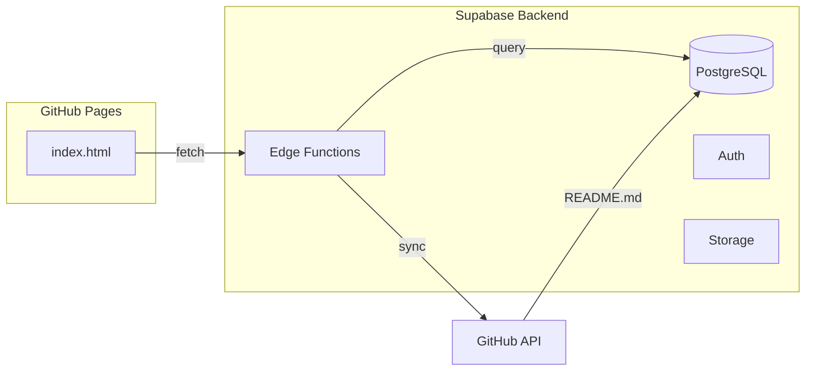

# Migration Supabase - DependabotSecureFlow

Guide de migration vers Supabase pour ajouter un backend au projet.

---

## Pourquoi Supabase ?

| Fonctionnalité | Avant (statique) | Après (Supabase) |
|----------------|------------------|------------------|
| Stockage README | GitHub raw | Base de données |
| Cache | Aucun | Cache Supabase |
| Analytics | Aucun | Tracking visites |
| Auth | Aucun | Connexion utilisateurs |
| API | GitHub API | Supabase REST/GraphQL |

---

## Architecture Cible



---

## Tables Supabase

### `documents`

Stocke le contenu du README avec cache.

```sql
CREATE TABLE documents (
    id UUID PRIMARY KEY DEFAULT gen_random_uuid(),
    repo_owner TEXT NOT NULL,
    repo_name TEXT NOT NULL,
    branch TEXT NOT NULL DEFAULT 'main',
    file_path TEXT NOT NULL DEFAULT 'README.md',
    content TEXT,
    last_fetched TIMESTAMPTZ DEFAULT NOW(),
    etag TEXT,
    UNIQUE(repo_owner, repo_name, branch, file_path)
);
```

### `analytics` (optionnel)

Tracking des visites.

```sql
CREATE TABLE analytics (
    id UUID PRIMARY KEY DEFAULT gen_random_uuid(),
    page TEXT NOT NULL,
    visitor_id TEXT,
    user_agent TEXT,
    created_at TIMESTAMPTZ DEFAULT NOW()
);
```

---

## Edge Function: Sync README

Fonction qui synchronise le README depuis GitHub.

```typescript
// supabase/functions/sync-readme/index.ts
import { serve } from "https://deno.land/std@0.168.0/http/server.ts"
import { createClient } from "https://esm.sh/@supabase/supabase-js@2"

serve(async (req) => {
    const supabase = createClient(
        Deno.env.get('SUPABASE_URL')!,
        Deno.env.get('SUPABASE_SERVICE_ROLE_KEY')!
    )

    const { repo_owner, repo_name, branch, file_path } = await req.json()

    // Fetch from GitHub
    const rawUrl = `https://raw.githubusercontent.com/${repo_owner}/${repo_name}/${branch}/${file_path}`
    const response = await fetch(rawUrl)

    if (!response.ok) {
        return new Response(JSON.stringify({ error: 'Failed to fetch' }), { status: 404 })
    }

    const content = await response.text()

    // Upsert in database
    const { data, error } = await supabase
        .from('documents')
        .upsert({
            repo_owner,
            repo_name,
            branch,
            file_path,
            content,
            last_fetched: new Date().toISOString()
        })
        .select()
        .single()

    return new Response(JSON.stringify(data), {
        headers: { 'Content-Type': 'application/json' }
    })
})
```

---

## Modification index.html

Remplacer le fetch GitHub par Supabase :

```javascript
// CONFIGURATION
const SUPABASE_URL = 'https://xxxxx.supabase.co'
const SUPABASE_ANON_KEY = 'eyJhbGc...'
const REPO_OWNER = 'EthanThePhoenix38'
const REPO_NAME = 'dependabot-secure-flow'

async function loadContent() {
    try {
        // Option 1: Direct query (si RLS configuré)
        const response = await fetch(
            `${SUPABASE_URL}/rest/v1/documents?repo_owner=eq.${REPO_OWNER}&repo_name=eq.${REPO_NAME}&select=content`,
            {
                headers: {
                    'apikey': SUPABASE_ANON_KEY,
                    'Authorization': `Bearer ${SUPABASE_ANON_KEY}`
                }
            }
        )

        const [doc] = await response.json()

        if (!doc) {
            throw new Error('Document not found')
        }

        const markdown = doc.content
        // ... reste du parsing markdown

    } catch (error) {
        // Fallback vers GitHub si Supabase échoue
        const rawUrl = `https://raw.githubusercontent.com/${REPO_OWNER}/${REPO_NAME}/main/README.md`
        const response = await fetch(rawUrl)
        const markdown = await response.text()
        // ...
    }
}
```

---

## Cron: Sync automatique

Ajouter un cron dans Supabase pour synchroniser toutes les 2h :

```sql
-- Dans Supabase Dashboard > SQL Editor
SELECT cron.schedule(
    'sync-readme-every-2h',
    '0 */2 * * *',  -- Toutes les 2h aux heures paires (00:00, 02:00, 04:00...)
    $$
    SELECT net.http_post(
        url := 'https://xxxxx.supabase.co/functions/v1/sync-readme',
        body := '{"repo_owner": "EthanThePhoenix38", "repo_name": "dependabot-secure-flow", "branch": "main", "file_path": "README.md"}'::jsonb
    );
    $$
);
```

---

## Variables d'environnement

| Variable | Description |
|----------|-------------|
| `SUPABASE_URL` | URL du projet Supabase |
| `SUPABASE_ANON_KEY` | Clé publique (frontend) |
| `SUPABASE_SERVICE_ROLE_KEY` | Clé privée (Edge Functions) |

---

## Étapes de migration

1. [ ] Créer projet Supabase
2. [ ] Créer table `documents`
3. [ ] Déployer Edge Function `sync-readme`
4. [ ] Configurer cron sync toutes les 2h
5. [ ] Modifier `index.html` pour utiliser Supabase
6. [ ] Ajouter fallback GitHub en cas d'erreur
7. [ ] Tester en local
8. [ ] Déployer sur GitHub Pages

---

## Avantages

- **Cache**: Le README est en BDD, pas de rate-limit GitHub
- **Vitesse**: Supabase Edge = CDN mondial
- **Cron 2h**: Sync automatique toutes les 2 heures (00:00, 02:00, 04:00...)
- **Analytics**: Possibilité de tracker les visites
- **Évolutif**: Facile d'ajouter auth, commentaires, etc.

---

## Coût

Supabase Free Tier :
- 500 MB database
- 2 GB bandwidth
- 500K Edge Function invocations/mois

→ **Gratuit** pour ce use case.
